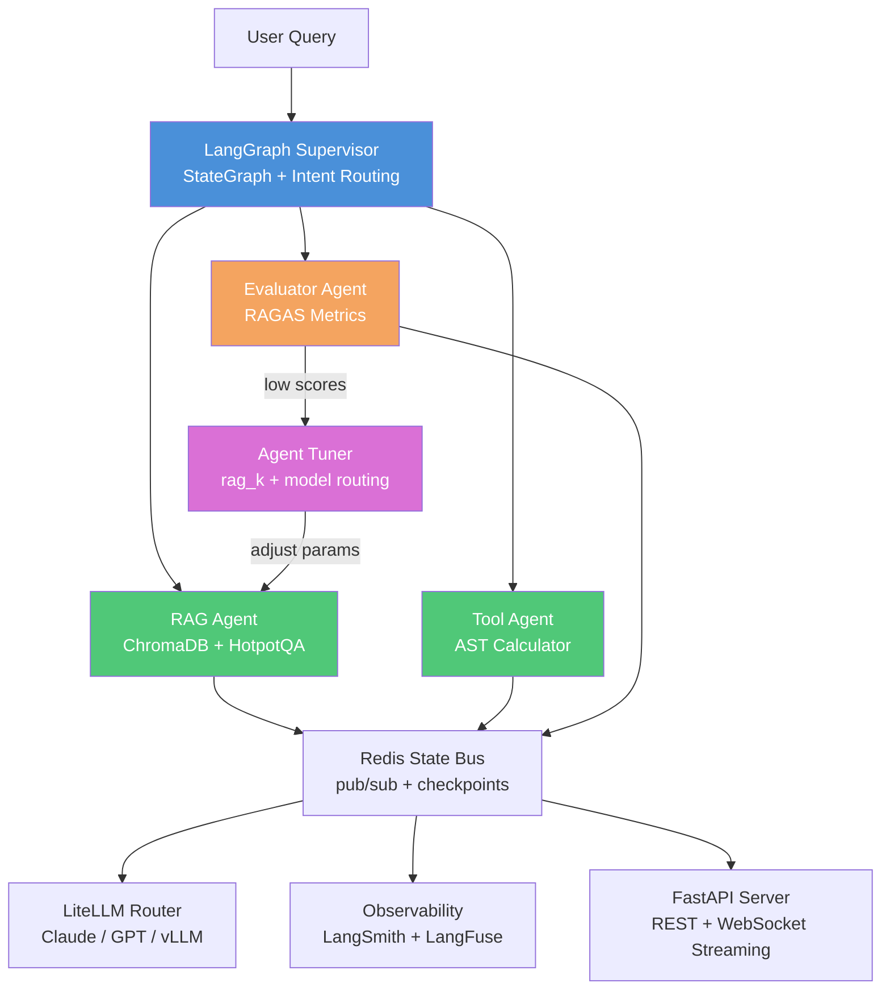

# SoulGraph

[](https://github.com/rishav1305/soulgraph/actions/workflows/ci.yml)
[](https://www.python.org/downloads/)
[](https://langchain-ai.github.io/langgraph/)
[](LICENSE)

**Batteries-included LangGraph: RAG + Eval + Fine-tuning + Orchestration in one framework.**

Feed it documents, ask a question — it retrieves, answers, and *automatically evaluates its own output quality* using RAGAS metrics. Every response is traceable, every answer is scored.

Built to demonstrate the full stack of production AI engineering: orchestration, RAG, evaluation, multi-model routing, state persistence, and observability — wired together in one coherent system.

---

## Why SoulGraph?

Most multi-agent frameworks give you orchestration **or** evaluation. SoulGraph integrates both — plus RAG and fine-tuning — in one coherent system.

| Problem | SoulGraph's Answer |
|---------|-------------------|
| Agents hallucinate without feedback | Every response is scored by RAGAS. Low scores trigger automatic parameter tuning. |
| Evaluation is a separate pipeline | Evaluation is an agent in the graph — it runs on every query, not as an afterthought. |
| Swapping models requires rewiring | LiteLLM router lets you swap Claude, GPT-4, or self-hosted vLLM with one env var. |
| State is lost between turns | Redis checkpoint persistence resumes any session exactly where it left off. |
| Observability bolted on after | Dual tracing (LangSmith + LangFuse) is built in from day one. |

This isn't a toy demo. It's a reference architecture for how production multi-agent systems should work: **orchestrate, retrieve, generate, evaluate, tune — in a loop.**

---

## What It Does

```
$ soulgraph "What is retrieval-augmented generation?" --session-id demo

✓ RAG Agent    → Retrieved 4 relevant documents (ChromaDB)
✓ Tool Agent   → No tool calls required
✓ Evaluator    → faithfulness: 0.91  relevancy: 0.88  precision: 0.85  recall: 0.82

Answer: Retrieval-Augmented Generation (RAG) combines a retrieval system
with a language model. The retriever fetches relevant documents from a
knowledge base; the model generates answers grounded in those documents
rather than relying on parametric memory alone — reducing hallucination
and enabling domain-specific knowledge without fine-tuning.

Eval: PASS (avg 0.87) | Session resumed: demo | Tokens: 312
```

```
# REST API
curl -s -X POST http://localhost:8080/query \
  -H "Content-Type: application/json" \
  -d '{"question": "calculate 6 * 7", "session_id": "demo"}'

{"answer": "Tool result (calculator): 42", "eval": {"score": 1.0, "pass": true}}
```

---

## Architecture



<details>
<summary>ASCII version (for terminals / non-GitHub viewers)</summary>

```
                          ┌──────────────────────────────────────────────┐
                          │           LangGraph Supervisor               │
                          │   StateGraph · Intent Routing · State Bus    │
                          └──────────┬───────────────────────────────────┘
                                     │
              ┌──────────────────────┼──────────────────────┐
              │                      │                      │
              ▼                      ▼                      ▼
   ┌─────────────────┐    ┌─────────────────┐    ┌─────────────────┐
   │    RAG Agent    │    │   Tool Agent    │    │ Evaluator Agent │
   │  ChromaDB +     │    │  AST calculator │    │ RAGAS metrics   │
   │  HotpotQA data  │    │  (safe eval)    │    │ JSON report     │
   └────────┬────────┘    └────────┬────────┘    └────────┬────────┘
            │                      │                      │
            └──────────────────────┴──────────────────────┘
                                   │
              ┌────────────────────┼────────────────────┐
              │                    │                    │
              ▼                    ▼                    ▼
   ┌──────────────────┐  ┌──────────────────┐  ┌──────────────────┐
   │  Redis State Bus │  │  LiteLLM Router  │  │  Observability   │
   │  pub/sub +       │  │  claude-3 · gpt  │  │  LangSmith +     │
   │  checkpoints     │  │  vLLM backend    │  │  LangFuse UI     │
   └──────────────────┘  └──────────────────┘  └──────────────────┘
              │
              ▼
   ┌──────────────────┐
   │   FastAPI Server │
   │  REST + WebSocket│
   │  streaming       │
   └──────────────────┘
```

</details>

**Supervisor** routes queries to specialist agents via LangGraph `StateGraph`. Intent classification selects RAG (knowledge questions) or Tool Agent (compute tasks). State is typed, immutable, and persisted in Redis between turns.

**RAG Agent** retrieves from ChromaDB (seeded with HotpotQA for multi-hop reasoning), generates grounded answers via Claude, and passes context to the Evaluator.

**Evaluator Agent** runs four RAGAS metrics (faithfulness, answer_relevancy, context_precision, context_recall) and emits structured JSON quality reports. Every query is scored.

**LiteLLM Router** selects model by task type (reasoning vs. fast) and supports vLLM self-hosted inference as a drop-in backend — swap cloud API for local GPU with one env var.

**Redis** provides shared agent state bus (pub/sub) and LangGraph checkpoint persistence. Same `--session-id` resumes any conversation exactly where it left off.

---

## Tech Stack

| Layer | Technology | Why |
|-------|-----------|-----|
| **Orchestration** | LangGraph `StateGraph` | Type-safe, cyclical agent graphs; clean state passing between agents |
| **LLM Abstraction** | LiteLLM | Model-agnostic routing; swap Claude ↔ GPT-4 ↔ vLLM without code changes |
| **Vector Store** | ChromaDB | Embedded, no infra overhead; persistence via Docker volume |
| **State Bus** | Redis pub/sub + `RedisSaver` | Cross-agent coordination + LangGraph checkpoint persistence in one service |
| **Evaluation** | RAGAS | Industry-standard RAG eval: faithfulness, relevancy, precision, recall |
| **Tracing** | LangSmith + LangFuse | Dual tracing support; LangFuse runs locally via Docker |
| **API** | FastAPI + WebSocket | Async REST + real-time token streaming |
| **Web UI** | React 19 + Vite 7 + Tailwind v4 | Real-time chat, SVG graph viz, RAGAS scorecard, tuner dashboard |
| **Inference backend** | vLLM (optional) | Self-hosted GPU inference via LiteLLM's OpenAI-compatible shim |
| **CI** | GitHub Actions | Ruff + Mypy + Pytest on every push; green main policy |

---

## Quick Start

### Full Stack (API + Web UI + Infrastructure)

**Prerequisites:** Docker, Anthropic API key

```bash
# Clone
git clone https://github.com/rishav1305/soulgraph.git
cd soulgraph

# Configure
cp .env.example .env          # Add your ANTHROPIC_API_KEY

# Start everything
docker compose up -d

# Open the Web UI
open http://localhost:8080
```

That's it. `docker compose up` builds the web UI, starts the Python API, and spins up Redis + ChromaDB + LangFuse. The web UI serves from the same port as the API.

### Development Setup (without Docker)

**Prerequisites:** Python 3.11+, Node 22+, Anthropic API key

```bash
# Backend
pip install -e ".[dev]"
docker compose up redis chromadb -d   # Just infrastructure

# Frontend (separate terminal)
cd web
npm install
npm run mock-ws &                     # Mock backend on :8080
npm run dev                           # Vite dev server on :5173

# Or run the real backend
uvicorn soulgraph.api:app --reload    # Real API on :8080
```

### CLI Only

```bash
pip install -e .
soulgraph "What is multi-hop reasoning?" --session-id my-session
```

### REST API

```bash
curl -X POST http://localhost:8080/query \
  -H "Content-Type: application/json" \
  -d '{"question": "calculate 15 * 8", "session_id": "demo"}'
```

**Optional: LangFuse tracing UI (http://localhost:3100)**
```bash
# LangFuse starts automatically with docker compose up
# Set LANGFUSE_PUBLIC_KEY and LANGFUSE_SECRET_KEY in .env
```

**Optional: Switch to vLLM self-hosted inference**
```bash
export VLLM_BASE_URL=http://localhost:8000
export VLLM_MODEL=meta-llama/Llama-3-8B-Instruct
soulgraph "your question"   # routes to local GPU, no cloud API calls
```

---

## Evaluation Pipeline

Every query runs four RAGAS metrics:

| Metric | What It Measures |
|--------|-----------------|
| **Faithfulness** | Does the answer stick to the retrieved context? (hallucination detection) |
| **Answer Relevancy** | Does the answer actually address the question? |
| **Context Precision** | Is the retrieved context relevant to the question? |
| **Context Recall** | Was all necessary context retrieved? |

Results are returned as structured JSON alongside every answer — making quality regression visible over time:

```json
{
  "answer": "...",
  "eval": {
    "faithfulness": 0.91,
    "answer_relevancy": 0.88,
    "context_precision": 0.85,
    "context_recall": 0.82,
    "pass": true,
    "latency_ms": 1240
  }
}
```

---

## Web UI

The web UI is a standalone React 19 SPA served by the same FastAPI server. It streams agent responses in real-time via WebSocket.

**Features:**
- Real-time token streaming with word-by-word display
- SVG agent graph visualization (supervisor → rag/tool → evaluator → END)
- RAGAS evaluation scorecard with metric bars and pass/fail badges
- Agent tuner dashboard with sparkline history chart
- Session management with localStorage persistence
- Dark zinc theme with gold accent

**Stack:** React 19, TypeScript 5.9, Vite 7, Tailwind CSS v4

**Development:**
```bash
cd web
npm install
npm run dev          # Vite dev server on :5173 (proxies API to :8080)
npm run mock-ws      # Mock backend with streaming (no Docker needed)
npm run build        # Production build → dist/
npm run typecheck    # tsc --noEmit
npx vitest run       # Run test suite
```

---

## Development

```bash
# Python backend
make ci          # Full CI: lint + type check + test (91% coverage)
make test        # Run pytest
make lint        # Ruff lint + format check
make type        # Mypy type check
make infra-up    # Start Redis + ChromaDB
make infra-down  # Stop services

# Web frontend
cd web && npm run build && npm run typecheck && npx vitest run
```

---

## Project Status

| Phase | Scope | Status |
|-------|-------|--------|
| **Phase 0** | Repo scaffold + Docker + CI | ✅ Done |
| **Phase 1** | Supervisor + RAG Agent + Evaluator | ✅ Done (Mar 23) |
| **Phase 2** | Redis state bus + LiteLLM router + FastAPI + LangFuse + vLLM | ✅ Done (Mar 25) |
| **Phase 3 Wave 1** | EvalReport (JSON/HTML), vLLM backend, acceptance criteria | ✅ Done (Mar 25) |
| **Phase 3 Wave 3** | Agent fine-tuning — eval feedback loop, rag_k + model routing | ✅ Done (Mar 25) |
| **Phase 4** | Standalone Web UI — chat, graph viz, eval scorecard, tuner dashboard | ✅ Done (Mar 28) |
| **Phase 3 Wave 2** | NeMo Guardrails + pgvector hybrid retrieval | 🔜 Planned |
| **Phase 3 Wave 4** | Colab notebook + end-to-end walkthrough | 🔜 Planned |

**Agent fine-tuning (Wave 3):** After each query, RAGAS scores feed back into AgentTuner. Low faithfulness triggers `rag_k` increase. Low relevancy triggers reasoning model. All adjustments are logged with reasoning.

**Web UI (Phase 4):** Full React SPA with real-time streaming, SVG agent graph visualization, RAGAS metric scorecard, and tuner dashboard — all served from the FastAPI server. `docker compose up` gives you the full stack.

---

## Related Projects

| Project | Description |
|---------|-------------|
| [**soul**](https://github.com/rishav1305/soul) | Full-stack AI platform — 13 Go microservices, React frontend, 127 Claude tools |
| [**soul-team**](https://github.com/rishav1305/soul-team) | Multi-agent runtime for Claude Code — distributed coordination across machines |
| [**soul-bench**](https://github.com/rishav1305/soul-bench) | CARS benchmark — cost-adjusted LLM evaluation (52 models, 7 providers) |
| [**preset-toolkit**](https://github.com/rishav1305/preset-toolkit) | Claude Code plugin for safe Preset/Superset dashboard management |
| [**dbt-toolkit**](https://github.com/rishav1305/dbt-toolkit) | Claude Code plugin for dbt workflow automation |

SoulGraph is the orchestration and evaluation engine. Soul-team is the operational layer. Soul is the interface. Together they form a complete AI engineering stack.

---

## Author

**Rishav Chatterjee** — Senior AI Architect

- Portfolio: [rishavchatterjee.com](https://rishavchatterjee.com)
- CARS Dashboard: [rishavchatterjee.com/cars](https://rishavchatterjee.com/cars)
- GitHub: [github.com/rishav1305](https://github.com/rishav1305)
- LinkedIn: [linkedin.com/in/rishavchatterjee](https://linkedin.com/in/rishavchatterjee)

---

## Contributing

PRs welcome. See [CLAUDE.md](CLAUDE.md) for development conventions, architecture decisions, and CI policy.
